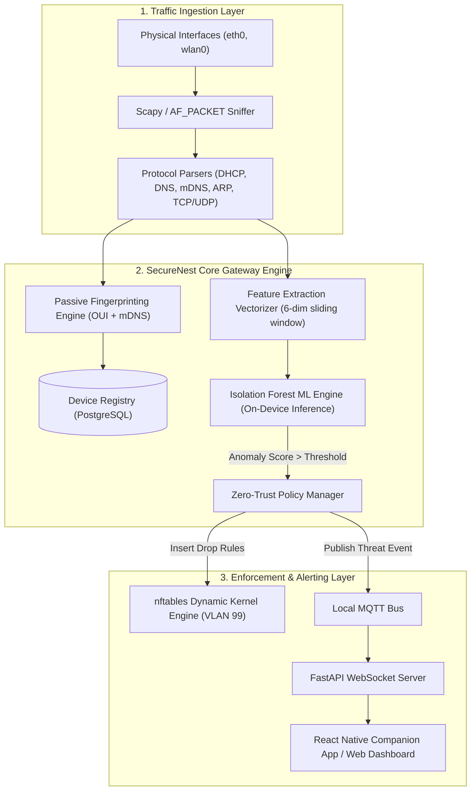

# SECURENEST: Enterprise & Hackathon Documentation Suite
**Edge-AI Security & Trust Layer for Connected Homes**
*Track: Cybersecurity · IoT · Smart Living*

---

## Table of Contents
1. [Executive Summary & Pitch Strategy](#1-executive-summary--pitch-strategy)
2. [Product Requirements Document (PRD)](#2-product-requirements-document-prd)
3. [Software Requirements Specification (SRS)](#3-software-requirements-specification-srs)
4. [System & Technical Architecture](#4-system--technical-architecture)
5. [ML Behavioral Engine & Isolation Forest Pipeline](#5-ml-behavioral-engine--isolation-forest-pipeline)
6. [Network Micro-Segmentation & `nftables` Engine](#6-network-micro-segmentation--nftables-engine)
7. [Data Schemas, State Machines & API Specifications](#7-data-schemas-state-machines--api-specifications)
8. [UI/UX Design Specification & Screen Blueprints](#8-uiux-design-specification--screen-blueprints)
9. [Hackathon Live Demo Script & Judge Q&A Defense](#9-hackathon-live-demo-script--judge-qa-defense)
10. [Roadmap & Post-Hackathon Commercialization](#10-roadmap--post-hackathon-commercialization)

---

# 1. Executive Summary & Pitch Strategy

### 1.1 The Hook & Core Problem
Modern homes host **15 to 40 connected smart devices** (smart locks, surveillance cameras, thermostats, baby monitors, smart plugs). 
- **The Blind Spot**: Devices join Wi-Fi silently. Homeowners have zero unified visibility into what hardware is running on their local network.
- **Vulnerable by Design**: Factory defaults, hardcoded SSH credentials, outdated firmware, and abandoned OEM maintenance make consumer IoT the easiest entry point for attackers.
- **The Blast Radius**: Consumer networks are flat (`/24` subnets). Once a $20 smart lightbulb or IP camera is compromised, the attacker has unfettered lateral traversal to personal laptops, NAS drives, and sensitive home assets (e.g., Mirai botnet attack patterns).

```
   [ Traditional Flat Network ]               [ SecureNest Zero-Trust Network ]
       +-------------------+                         +-------------------+
       |  Internet Router  |                         | SecureNest Edge-AI|
       +---------+---------+                         +---------+---------+
                 |                                             |
   +-------------+-------------+                 +-------------+-------------+
   |             |             |                 | (VLAN 10)   | (VLAN 20)   | (VLAN 99 - QUARANTINE)
[Laptop] <---> [Camera*] <-> [Lock]           [Laptop]     [Smart TV]     [Compromised Camera*]
  (Compromise reaches all devices)            (Isolated)   (Isolated)     (STRICT ISOLATION - 0 Lateral Traffic)
```

### 1.2 The Value Proposition
> **"SecureNest turns any home network into an autonomous, zero-trust perimeter with on-device edge AI. It discovers every device, baselines its behavior locally, detects anomalies in seconds, and automatically quarantines compromised hardware via hardware-accelerated micro-segmentation — with zero cloud reliance, zero subscription lock-in, and zero privacy leakage."**

### 1.3 Competitive Differentiation Matrix

| Feature | Consumer Routers (Eero, Nest WiFi) | Cloud Security (Bitdefender BOX, Firewalla) | Commercial NGFW (Palo Alto, Fortinet) | **SecureNest (Edge-AI Layer)** |
| :--- | :--- | :--- | :--- | :--- |
| **Privacy / Edge Execution** | Cloud telemetry dependent | Cloud packet/DNS analysis | Cloud-managed rules | **100% On-Device (Zero data leaves LAN)** |
| **Micro-Segmentation** | Guest network only (binary) | Manual IP/Port blocking | Complex 802.1Q tagging | **Autonomous sub-second VLAN quarantine** |
| **Anomaly Intelligence** | Static signature matching | Cloud ML heuristic checks | Enterprise behavioral engines | **Per-device Isolation Forest on Edge TPU/ARM** |
| **User Experience** | Technical network tables | Network engineer charts | Enterprise CLI/Dashboard | **Plain-English alerts with 1-tap actions** |
| **Hardware Overhead** | Replaces router ($300+) | Expensive appliances ($200+) | Enterprise hardware ($1000+) | **Plug-and-play SBC (Raspberry Pi 4/5 / OpenWrt)** |

---

# 2. Product Requirements Document (PRD)

## 2.1 Product Goals & Success Metrics
- **Zero-Configuration Onboarding**: Device discovers and classifies >90% of household connected devices within 5 minutes of network connection without manual user tagging.
- **Sub-Second Containment (MTTR)**: Automatic isolation of anomalous devices in **< 1.0 second** of anomaly confirmation.
- **Zero False-Positive Quarantine Rate for Core Utilities**: Ensure essential infrastructure (thermostats, smart locks) is not erroneously quarantined by applying class-specific baseline tuning.
- **100% Data Sovereignty**: 0 KB of device payloads, camera video feeds, or raw network packets leave the gateway premises.

## 2.2 Target Personas

### Persona A: "Non-Technical Homeowner" (Sarah, 38, Busy Parent)
- **Pain Point**: Owns 25+ smart devices (baby monitor, Ring doorbell, smart TVs). Worried about camera hacks and privacy leaks seen in the news, but has no networking knowledge.
- **Goal**: Wants a "set-it-and-forget-it" appliance that sends clear, actionable alerts like: *"Your baby monitor is sending data to an unknown server in Eastern Europe. We isolated it. [Keep Blocked] [Trust Device]"*.

### Persona B: "Tech Enthusiast / Prosumer" (Alex, 29, Software Engineer)
- **Pain Point**: Maintains smart home automation (Home Assistant, Zigbee/Z-Wave bridges). Frustrated by router software that hides packet metrics or forces cloud dependencies.
- **Goal**: Wants real-time packet telemetry, configurable anomaly thresholds, custom VLAN rules, MQTT event publishing, and local API access.

## 2.3 User Stories & Acceptance Criteria

```
+---------------------------------------------------------------------------------------------+
| USER STORY 1: Passive Device Discovery & Inventory Generation                               |
+---------------------------------------------------------------------------------------------+
| As a homeowner,                                                                             |
| I want all newly connected Wi-Fi/Ethernet devices to be automatically identified,           |
| So that I can maintain an accurate real-time inventory of everything in my house.          |
+---------------------------------------------------------------------------------------------+
| Acceptance Criteria:                                                                        |
| 1. Gateway captures DHCP Request, mDNS broadcasts, and ARP traffic within 30s of connection. |
| 2. MAC OUI lookup resolves hardware manufacturer (e.g., Espressif, Tuya, Apple, Ring).      |
| 3. Device category assigned automatically (Smart Camera, Smart Plug, Hub, Workstation).     |
| 4. Device state stored in local SQLite/PostgreSQL and pushed to React Native frontend.      |
+---------------------------------------------------------------------------------------------+

+---------------------------------------------------------------------------------------------+
| USER STORY 2: On-Device Behavioral Anomaly Detection                                        |
+---------------------------------------------------------------------------------------------+
| As a privacy-conscious user,                                                                |
| I want abnormal traffic patterns (port scans, DDoS floods, unusual DNS) detected locally,   |
| So that compromised devices are caught without inspecting or exporting my private data.    |
+---------------------------------------------------------------------------------------------+
| Acceptance Criteria:                                                                        |
| 1. System records 6-dimensional traffic features per device into a sliding baseline window. |
| 2. On-device Scikit-Learn Isolation Forest scores anomaly level every 5-second interval.    |
| 3. High-entropy bursts or lateral port sweeps trigger a Critical Threat state within 3 sec.|
+---------------------------------------------------------------------------------------------+

+---------------------------------------------------------------------------------------------+
| USER STORY 3: Automated Micro-Segmentation & Emergency Quarantine                           |
+---------------------------------------------------------------------------------------------+
| As a network owner,                                                                         |
| I want infected devices immediately isolated from the rest of my home network,              |
| So that attackers cannot jump from an IoT gadget to my personal computer or financial data. |
+---------------------------------------------------------------------------------------------+
| Acceptance Criteria:                                                                        |
| 1. Anomaly trigger executes dynamic `nftables` rule insertion in < 500ms.                  |
| 2. Device is moved to Quarantine VLAN (VLAN 99) with WAN/LAN DROP rules.                    |
| 3. Gateway broadcasts MQTT alert and WebSocket notification to companion app.               |
| 4. User provided with 1-tap "Un-quarantine / Re-authorize" manual override button.          |
+---------------------------------------------------------------------------------------------+
```

---

# 3. Software Requirements Specification (SRS)
*Compliant with IEEE Std 830-1998 Format*

## 3.1 External Interface Requirements
- **Hardware Interface**: Raspberry Pi 4 Model B (4GB/8GB) / Raspberry Pi 5. Dual NIC configuration:
  - `eth0` (WAN): Uplink to upstream ISP modem/router (DHCP Client).
  - `wlan0` / `eth1` (LAN): Access Point & Managed Switch Interface (Hostapd / Static `192.168.50.1/24`).
- **Software Interfaces**:
  - Linux Kernel 6.1+ with `nftables`, `eBPF`/`AF_PACKET`, `802.1Q` VLAN module enabled.
  - Mosquitto MQTT Broker (port `1883` / `8883` TLS) for inter-process telemetry bus.
  - PostgreSQL 15 / SQLite3 with WAL mode for local high-throughput event logging.
- **Communication Protocols**:
  - DHCP (RFC 2131), mDNS/DNS-SD (RFC 6762/6763), SSDP/UPnP, TLS 1.3, HTTPS/WSS.

## 3.2 System Features & Functional Specifications



### 3.2.1 Passive Fingerprinting Specification (Module: `sn_discovery`)
- **FR-DISC-001**: The system shall continuously monitor promiscuous raw sockets on all internal bridges.
- **FR-DISC-002**: Upon receiving a `DHCPDISCOVER` or `DHCPREQUEST`, the engine shall extract:
  - Option 55 (Parameter Request List)
  - Option 60 (Vendor Class Identifier)
  - Option 12 (Host Name)
- **FR-DISC-003**: The engine shall map the first 24 bits of the device MAC address to the IEEE OUI registry cached locally.
- **FR-DISC-004**: Query mDNS services (`_http._tcp.local`, `_airplay._tcp.local`, `_googlecast._tcp.local`, `_hap._tcp.local`) to infer device model name.

### 3.2.2 Behavioral Anomaly Detection Specification (Module: `sn_detector`)
- **FR-DET-001**: The system shall sample network flows aggregated in 5-second tumbling windows.
- **FR-DET-002**: The feature extraction pipeline shall compute 6 continuous variables per device:
  1. $f_1$: Outbound packet rate (packets/sec)
  2. $f_2$: Inbound/Outbound byte ratio ($\log_{10}(\text{bytes\_in} / \text{bytes\_out} + \epsilon)$)
  3. $f_3$: Destination IP entropy ($H(IP) = -\sum p_i \log_2 p_i$)
  4. $f_4$: Destination Port diversity (count of unique external ports accessed)
  5. $f_5$: Syn/Ack packet asymmetry ($\text{TCP SYN count} - \text{TCP ACK count}$)
  6. $f_6$: DNS request frequency & NXDOMAIN ratio
- **FR-DET-003**: Anomaly score $S(x)$ shall be computed via scikit-learn / ONNX / TFLite Isolation Forest. If $S(x) > \tau_{\text{class}}$, trigger state transition to `SUSPICIOUS` or `COMPROMISED`.

### 3.2.3 Dynamic Micro-Segmentation Specification (Module: `sn_enforcer`)
- **FR-ENF-001**: Enforcement shall operate directly inside Linux `nftables` via `libnftables` Python bindings or atomic rule generation.
- **FR-ENF-002**: Standard IoT devices shall operate in `VLAN_TRUSTED_IOT` (`192.168.50.0/24`).
- **FR-ENF-003**: Quarantined devices shall be atomically reassigned to `VLAN_QUARANTINE` (VLAN tag `99`, IP range `192.168.99.0/24`) with default policy `DROP` for all forward and output chains.

## 3.3 Non-Functional Requirements (NFR)
- **Performance**: Anomaly evaluation latency $\le 85\text{ms}$ per device vector on quad-core ARM Cortex-A72 @ 1.5GHz.
- **Memory Footprint**: Total gateway resident memory usage $\le 450\text{MB}$ RAM across all daemons.
- **Reliability & Fail-Safe**: If the Python daemon crashes, `nftables` static fallback allows existing established LAN connections while watchdog (`systemd`) restarts service in $< 2\text{s}$.
- **Security**: Local REST/WebSocket endpoints protected with JWT and mutual TLS (mTLS); no default root SSH password.

---

# 4. System & Technical Architecture

## 4.1 Layered Architecture Overview

```
+===========================================================================+
|                     PRESENTATION / CLIENT LAYER                           |
|  +---------------------------+       +---------------------------------+  |
|  | React Native Mobile App   | <---> | React 18 / Tailwind Web Console |  |
|  | (iOS / Android One-Tap)   |       | (Real-time Live SOC Topology)   |  |
|  +---------------------------+       +---------------------------------+  |
+====================================+======================================+
                                     | (TLS / WebSockets / REST API)
+====================================v======================================+
|                   SECURENEST GATEWAY APPLICATION LAYER                    |
|                                                                           |
|   +-------------------------------------------------------------------+   |
|   | FastAPI Application Server (Uvicorn / Asynchronous Event Loop)    |   |
|   |  - /api/v1/devices     - /api/v1/threats     - /api/v1/quarantine |   |
|   |  - /api/v1/telemetry   - /ws/live-stream     - /api/v1/override   |   |
|   +---------------------------------+---------------------------------+   |
|                                     |                                     |
|   +---------------------------------v---------------------------------+   |
|   | Redis / In-Memory State Cache & Mosquitto MQTT Pub/Sub Message Bus|   |
|   +---------------------------------+---------------------------------+   |
|                                     |                                     |
|   +---------------------------------v---------------------------------+   |
|   | Core Engine Daemons (Python 3.11 Multiprocessing)                 |   |
|   |  1. Packet Ingestion Daemon (Scapy + AF_PACKET Raw Sockets)       |   |
|   |  2. Device Classifier & Fingerprinting Engine                     |   |
|   |  3. ML Anomaly Inference Worker (Isolation Forest / TFLite)       |   |
|   |  4. Dynamic Policy Controller (Linux nftables IPC)                |   |
|   +---------------------------------+---------------------------------+   |
+====================================+======================================+
                                     |
+====================================v======================================+
|                    LINUX OS & HARDWARE PLATFORM LAYER                     |
|  +---------------------------------------------------------------------+  |
|  | Kernel Network Stack: nftables / eBPF / 802.1Q VLAN / Bridge-utils   |  |
|  | Hardware: Raspberry Pi 4/5 (Broadcom BCM2711 / BCM2712, Quad Core)  |  |
|  | Storage: Local SQLite3 / PostgreSQL Event Store + Encrypted Flash   |  |
|  +---------------------------------------------------------------------+  |
+===========================================================================+
```

## 4.2 Network Segment Architecture

```
                       +-------------------------+
                       |   WAN Uplink (Internet) |
                       +------------+------------+
                                    |
                            [ eth0 - DHCP ]
                                    |
                    +---------------v---------------+
                    |   SECURENEST EDGE GATEWAY     |
                    | (Raspberry Pi 4/5 Firewall)   |
                    +---------------+---------------+
                                    |
         +--------------------------+--------------------------+
         | [VLAN 10: Home Private]  | [VLAN 20: Smart IoT]     | [VLAN 99: Quarantine]
         | 192.168.10.0/24          | 192.168.20.0/24          | 192.168.99.0/24
         | (Laptops, Phones, NAS)   | (Cams, Thermostats, Hubs)| (Isolate Rogue Hardware)
         +-------------+------------+------------+-------------+-------------+
                       |                         |                           |
                [MacBook Pro]             [Smart Camera]              [Infected Bulb]
                [iPhone 15]               [Smart Lock]                - 0 WAN Access
                [Synology NAS]            [Nest Thermostat]           - 0 LAN Access
                                                                      - Trapped & Logged
```

---

# 5. ML Behavioral Engine & Isolation Forest Pipeline

## 5.1 Training & Baseline Window Strategy
To prevent false alarms on bursty IoT devices (e.g., smart plugs polling cloud servers every 10 minutes), SecureNest employs a two-tier baseline system:
1. **Initial Calibration Window (24–48 Hours)**: Device operates in learning mode. Flow metrics establish statistical distribution bounds ($\mu, \sigma$) per device class.
2. **Device-Class Feature Scaling**: Normalizes traffic bounds based on device profile (e.g., video streaming camera vs. low-power smart lock).

```
   Device Raw Packets
          │
          ▼
   ┌────────────────────────────────────────────────────────┐
   │ Rolling Window Aggregator (5-second tumbling sub-bins) │
   └──────────────────────┬─────────────────────────────────┘
                          │
                          ▼
   ┌────────────────────────────────────────────────────────┐
   │ 6-Dimensional Feature Vector Extraction:               │
   │ x = [ pkt_rate, byte_ratio, ip_entropy, port_div,      │
   │       syn_ack_asym, dns_nx_ratio ]                     │
   └──────────────────────┬─────────────────────────────────┘
                          │
                          ▼
   ┌────────────────────────────────────────────────────────┐
   │ Per-Class Robust Scaler (StandardScaler with Outliers) │
   └──────────────────────┬─────────────────────────────────┘
                          │
                          ▼
   ┌────────────────────────────────────────────────────────┐
   │ Isolation Forest Ensemble (100 Decision Trees on Edge) │
   └──────────────────────┬─────────────────────────────────┘
                          │
          ┌───────────────┴───────────────┐
          ▼                               ▼
   Score < Threshold               Score >= Threshold (e.g. 0.78)
   State: NORMAL                   State: ANOMALY TRIGGERED
   (Action: Pass)                  (Action: Execute nftables Quarantine)
```

## 5.2 Mathematical Model Formulation
The Anomaly Score $s(x, n)$ for an instance $x$ over an ensemble of $n$ isolation trees is given by:
$$s(x, n) = 2^{-\frac{\mathbb{E}(h(x))}{c(n)}}$$
Where:
- $h(x)$ is the path length of observation $x$ in a tree.
- $\mathbb{E}(h(x))$ is the average path length across all isolation trees.
- $c(n) = 2\left(\ln(n - 1) + 0.5772156649\right) - \frac{2(n - 1)}{n}$ is the average path length of unsuccessful searches in a Binary Search Tree (BST).
- **Classification Rule**:
  - $s \ge 0.75 \implies \text{Definite Compromise / Malicious Behavior}$
  - $0.60 \le s < 0.75 \implies \text{Suspicious Behavior (Rate-limit & Monitor)}$
  - $s < 0.60 \implies \text{Normal Traffic}$

---

# 6. Network Micro-Segmentation & `nftables` Engine

## 6.1 `nftables` Rule Blueprint for Sub-Second Quarantine
SecureNest uses atomic table swaps in `nftables` to eliminate network stalls and prevent dropping consumer connections.

```bash
#!/usr/sbin/nft -f
# SecureNest Core Firewall Table Definition

flush ruleset

table inet securenest {
    # Device Sets
    set trusted_devices {
        type ipv4_addr
        flags interval
        elements = { 192.168.20.10, 192.168.20.11, 192.168.20.12 }
    }

    set quarantined_devices {
        type ipv4_addr
        flags timeout
        elements = { }
    }

    # Ingress Filter Chain
    chain forward {
        type filter hook forward priority 0; policy drop;

        # 1. Allow established and related connections
        ct state established,related accept

        # 2. Drop invalid states immediately
        ct state invalid drop

        # 3. QUARANTINE ENFORCEMENT: Block any quarantined device from LAN & WAN
        ip saddr @quarantined_devices log prefix "[SECURENEST-QUARANTINE-BLOCKED]: " drop
        ip daddr @quarantined_devices drop

        # 4. Allow trusted devices to reach WAN (Internet)
        iifname "wlan0" oifname "eth0" ip saddr @trusted_devices accept

        # 5. Prevent IoT VLAN from initiating sessions into Private LAN (VLAN 10)
        iifname "vlan20" oifname "vlan10" drop
    }

    # NAT Configuration for Gateway Routing
    chain postrouting {
        type nat hook postrouting priority 100; policy accept;
        oifname "eth0" masquerade
    }
}
```

---

# 7. Data Schemas, State Machines & API Specifications

## 7.1 Database Relational Schema (PostgreSQL / SQLite)

```sql
-- Devices Table
CREATE TABLE devices (
    id VARCHAR(36) PRIMARY KEY, -- UUIDv4
    mac_address VARCHAR(17) UNIQUE NOT NULL,
    ip_address VARCHAR(15) NOT NULL,
    hostname VARCHAR(100),
    vendor VARCHAR(100),
    device_type VARCHAR(50) DEFAULT 'UNKNOWN', -- CAMERA, LOCK, SENSOR, SMART_PLUG, LAPTOP
    vlan_id INTEGER DEFAULT 20,
    trust_status VARCHAR(20) DEFAULT 'CALIBRATING', -- TRUSTED, CALIBRATING, SUSPICIOUS, QUARANTINED
    baseline_ready BOOLEAN DEFAULT FALSE,
    first_seen TIMESTAMP WITH TIME ZONE DEFAULT CURRENT_TIMESTAMP,
    last_seen TIMESTAMP WITH TIME ZONE DEFAULT CURRENT_TIMESTAMP
);

-- Threat Events Table
CREATE TABLE threat_events (
    id VARCHAR(36) PRIMARY KEY,
    device_id VARCHAR(36) REFERENCES devices(id) ON DELETE CASCADE,
    anomaly_score FLOAT NOT NULL,
    threat_category VARCHAR(50) NOT NULL, -- DDOS_FLOOD, LATERAL_SCAN, DATA_EXFILTRATION, BRUTE_FORCE
    summary TEXT NOT NULL,
    raw_telemetry JSONB, -- Stored locally, never sent to cloud
    action_taken VARCHAR(50) DEFAULT 'AUTO_QUARANTINED', -- AUTO_QUARANTINED, ALERTED_ONLY, DISMISSED
    created_at TIMESTAMP WITH TIME ZONE DEFAULT CURRENT_TIMESTAMP
);
```

---

# 8. UI/UX Design Specification & Screen Blueprints

- **Design Philosophy**: Minimalist Cyber-Physical Defense. Instant clarity for non-technical users.
- **Color Palette**:
  - **Shield Emerald (Safe / Trust)**: `#10B981`
  - **Threat Crimson (Quarantine / Alert)**: `#EF4444`
  - **Cyber Cyan (Telemetry / Active AI)**: `#06B6D4`
  - **Obsidian Deep (Background)**: `#0B0F19`

---

# 9. Hackathon Live Demo Script & Judge Q&A Defense

## 9.1 The 3-Minute Winning Demo Script

```
========================================================================================
TIMELINE   ACTION / SCREEN SHOWN                   SPEAKER SCRIPT / TALKING POINTS
========================================================================================
00:00-00:30 Slide 1 & Live Topology Dashboard      "Judges, the average home has 30 IoT 
             Showing 24 connected green devices.    devices with zero security. If one camera 
                                                    is hacked, the whole house is compromised. 
                                                    Meet SecureNest: an Edge-AI zero-trust 
                                                    gateway running right here on this Pi."

00:30-01:00 Connect New IoT Device (Plug/Cam)      "I'm plugging in a new device right now. 
             Live terminal + Web UI updates.        Watch our gateway passively capture its DHCP 
                                                    handshake and mDNS broadcasts. Within 3 
                                                    seconds, it is cataloged, fingerprinted as a 
                                                    Tuya Smart Bulb, and placed on low-trust policy."

01:00-01:45 Trigger Attack Simulation Script       "Now let's simulate an attacker weaponizing 
             `python3 simulate_mirai.py`            this camera with a Mirai botnet payload: 
             Sudden SYN flood + lateral scan.       port sweeps and high-entropy packet bursts."

01:45-02:15 Anomaly Model Fires & Quarantine Hits  "Look at the screen: within 400 milliseconds, 
             Screen flashes RED -> Isolated.        our on-device Isolation Forest scores the anomaly 
             `nftables` drops lateral traffic.      at 0.96. The gateway instantly inserts dynamic 
                                                    nftables drop rules. The device is isolated."

02:15-03:00 Proof of Containment + Laptop Ping     "Watch: my laptop can still stream video and 
             Laptop ping to camera: TIMEOUT.        access the internet, but the compromised camera 
             Laptop ping to Google: SUCCESS.        cannot talk to ANY home device. Complete 
                                                    containment. Zero cloud reliance. Total privacy."
========================================================================================
```

---

# 10. Roadmap & Post-Hackathon Commercialization

```
  +-----------------------+     +------------------------+     +------------------------+
  |    PHASE 1 (Now)      |     |     PHASE 2 (V1.2)     |     |     PHASE 3 (V2.0)     |
  |  Hackathon MVP (Done) | --> | Crowdsourced Intel     | --> | Router Firmware Engine |
  +-----------------------+     +------------------------+     +------------------------+
  - On-Device Discovery         - Anonymized Threat Hash       - Direct OpenWrt / DD-WRT
  - Isolation Forest ML           Sharing (Zero-Knowledge)       Embedded Kernel Driver
  - Dynamic nftables VLAN       - Manufacturer Cryptographic   - OEM Licensing with Home
  - React Native UI Prototype     Device Profiling (MUD/MUD-x)   Router Vendors (Netgear, ASUS)
```

---
*Authored by Team SecureNest for Hackathon Review & Production Engineering.*
